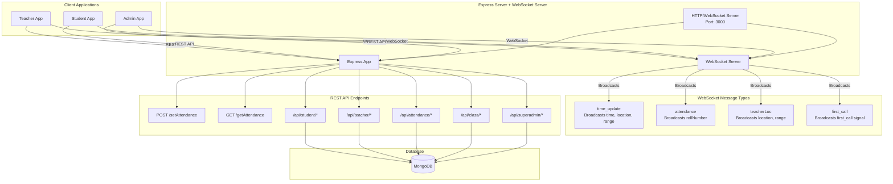
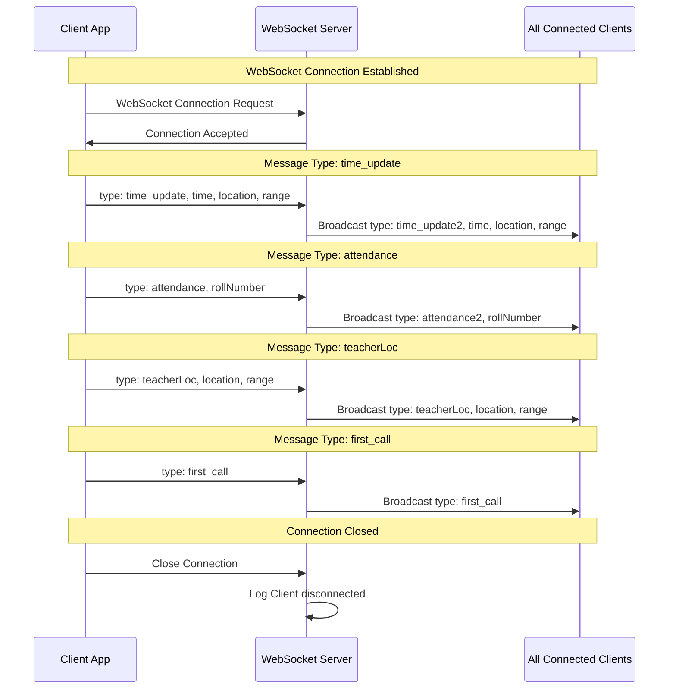
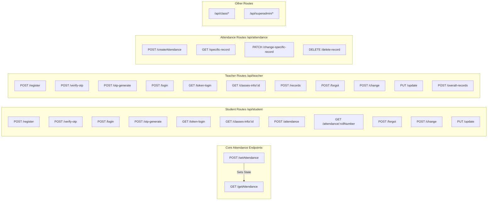
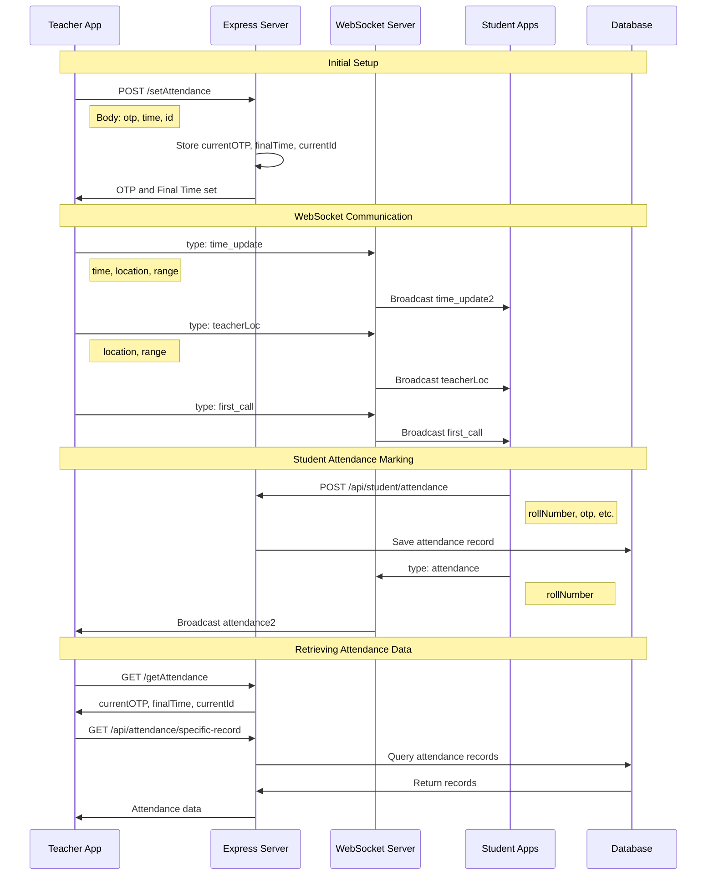

# AttenTrack Backend - System Flow Diagram

## Overview
This document describes the flow of WebSocket connections and REST API endpoints in the AttenTrack attendance tracking system.

---

## System Architecture Flow

---

## WebSocket Flow Diagram

---

## REST API Endpoints Flow

---

## Complete Attendance Flow (WebSocket + REST)

---

## WebSocket Message Types Reference

| Message Type (Incoming) | Broadcast Type (Outgoing) | Data Broadcasted | Purpose |
|------------------------|---------------------------|------------------|---------|
| `time_update` | `time_update2` | `time`, `location`, `range` | Broadcasts attendance session time and location details |
| `attendance` | `attendance2` | `rollNumber` | Notifies all clients when a student marks attendance |
| `teacherLoc` | `teacherLoc` | `location`, `range` | Broadcasts teacher's current location and range |
| `first_call` | `first_call` | (no data) | Signals the start of attendance session |

---

## REST API Endpoints Reference

### Core Attendance Endpoints
- **POST** `/setAttendance` - Sets global attendance state (OTP, time, ID)
- **GET** `/getAttendance` - Retrieves current attendance state

### Student Routes (`/api/student`)
- **POST** `/register` - Student registration
- **POST** `/verify-otp` - OTP verification
- **POST** `/login` - Student login
- **POST** `/otp-generate` - Generate OTP
- **GET** `/token-login` - Token-based login
- **GET** `/classes-info/:student_id` - Get enrolled classes
- **POST** `/attendance` - Mark attendance
- **GET** `/attendance/:rollNumber` - Get all attendance records
- **POST** `/forgot` - Forgot password
- **POST** `/change` - Change password
- **PUT** `/update` - Update student profile

### Teacher Routes (`/api/teacher`)
- **POST** `/register` - Teacher registration
- **POST** `/verify-otp` - OTP verification
- **POST** `/otp-generate` - Generate OTP
- **POST** `/login` - Teacher login
- **GET** `/token-login` - Token-based login
- **GET** `/classes-info/:teacher_id` - Get teacher's classes
- **POST** `/records` - Get attendance reports
- **POST** `/forgot` - Forgot password
- **POST** `/change` - Change password
- **PUT** `/update` - Update teacher profile
- **POST** `/overall-records` - Get overall attendance records

### Attendance Routes (`/api/attendance`)
- **POST** `/createAttendance` - Create attendance session
- **GET** `/specific-record` - Get specific attendance record
- **PATCH** `/change-specific-record` - Modify attendance record
- **DELETE** `/delete-record` - Delete attendance record

### Other Routes
- `/api/class/*` - Class management endpoints
- `/api/superadmin/*` - Super admin endpoints

---

## Key Features

1. **Real-time Communication**: WebSocket server enables real-time bidirectional communication between teacher and students
2. **Broadcast Mechanism**: All WebSocket messages are broadcasted to all connected clients
3. **State Management**: Global attendance state (OTP, time, ID) managed via REST endpoints
4. **Multi-role Support**: Separate routes for students, teachers, and super admins
5. **Authentication**: Token-based and OTP-based authentication flows
6. **Location Tracking**: Real-time location and range broadcasting for geofencing

---

## Usage Notes

- The WebSocket server runs on the same port as the HTTP server (default: 3000)
- All WebSocket messages are broadcasted to **all connected clients** (no filtering)
- The `/setAttendance` endpoint stores state in memory (not persistent across server restarts)
- CORS is configured to allow all origins (`*`)
- Swagger documentation available at `/api-docs`
